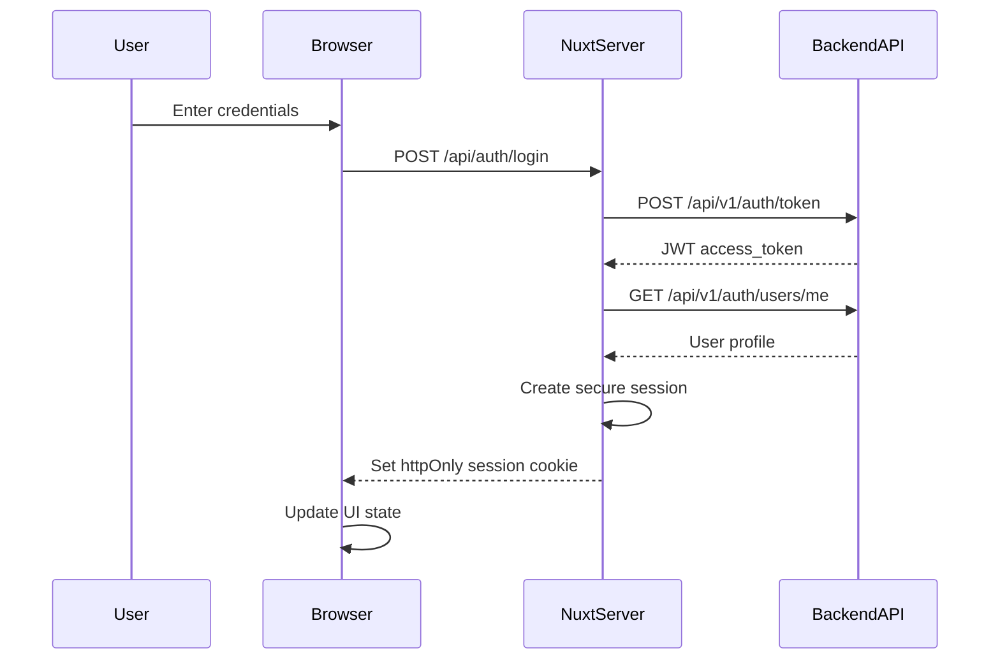

# Prebetter Frontend Architecture

This document provides a comprehensive overview of the Prebetter frontend architecture, a modern Security Information and Event Management (SIEM) dashboard built with Nuxt 3.

## Project Structure

The frontend follows Nuxt 3's file-based routing conventions with a clear separation of concerns:

```
frontend/
├── app/                          # Application source code
│   ├── app.vue                   # Root application component
│   ├── assets/                   # Static assets
│   │   └── css/
│   │       └── main.css          # Global Tailwind CSS entry
│   ├── components/               # Vue components
│   │   ├── ui/                   # shadcn-vue UI components
│   │   │   ├── button/
│   │   │   ├── card/
│   │   │   ├── dropdown-menu/
│   │   │   └── ...              # Other UI components
│   │   ├── Navbar.vue            # Global navigation component
│   │   └── ColorModeToggle.vue   # Dark/light mode switcher
│   ├── composables/              # Shared composition functions
│   ├── layouts/                  # Layout templates
│   │   └── default.vue           # Default application layout
│   ├── middleware/               # Route middleware
│   │   └── auth.global.ts        # Global authentication guard
│   ├── pages/                    # File-based routing
│   │   ├── index.vue             # Dashboard home page
│   │   ├── login.vue             # Authentication page
│   │   └── profile.vue           # User profile page
│   ├── plugins/                  # Nuxt plugins
│   └── utils/                    # Utility functions
│       └── utils.ts              # Common utilities (cn, etc.)
├── server/                       # Nitro server directory
│   ├── api/                      # Server API routes
│   │   ├── [...].ts              # API proxy catch-all route
│   │   └── auth/                 # Authentication endpoints
│   │       ├── login.post.ts     # Login endpoint
│   │       └── logout.post.ts    # Logout endpoint
│   └── plugins/                  # Server plugins
│       └── session.ts            # Session lifecycle hooks
├── public/                       # Static files
├── types/                        # TypeScript type definitions
│   └── auth.d.ts                 # Authentication types
├── auth.d.ts                     # Module augmentation for auth
├── nuxt.config.ts                # Nuxt configuration
├── package.json                  # Dependencies and scripts
├── components.json               # shadcn-vue configuration
└── tsconfig.json                 # TypeScript configuration
```

### Key Configuration Files

#### nuxt.config.ts
The central configuration file that defines:
- **Modules**: Core functionality extensions (auth, SEO, color mode, icons)
- **Runtime Config**: API base URL and session configuration
- **Tailwind CSS**: Integrated via @tailwindcss/vite
- **shadcn-vue**: Component library configuration
- **SEO**: Site metadata and structured data

#### components.json
Configuration for shadcn-vue components:
- Style preset: "new-york"
- TypeScript enabled
- CSS variables for theming
- Component path aliases

## Authentication Architecture

The authentication system is built on `nuxt-auth-utils` with a secure session-based approach that bridges JWT tokens from the backend API.

### Authentication Flow



### Session Management

#### Server-Side Session Storage
Sessions are managed by `nuxt-auth-utils` with the following structure:

```typescript
interface UserSession {
  user: {
    id: number
    email: string
    username: string
    fullName?: string
    isSuperuser: boolean
  }
  loggedInAt: string
}

interface SecureSessionData {
  apiToken: string  // JWT from backend, never exposed to client
}
```

#### Key Features:
- **Secure Token Storage**: JWT tokens are stored in the `secure` session data, accessible only server-side
- **Session Expiration**: 30-minute timeout matching backend JWT expiration
- **Automatic Token Forwarding**: API proxy automatically attaches tokens to backend requests
- **Session Hooks**: Plugin system for session lifecycle events

### Authentication Components

#### Login Flow (`/server/api/auth/login.post.ts`)
1. Validates credentials with backend `/api/v1/auth/token`
2. Fetches user profile with received JWT
3. Creates secure session with user data and token
4. Returns success response to client

#### Logout Flow (`/server/api/auth/logout.post.ts`)
1. Clears server-side session
2. Client redirects to login page
3. No backend API call needed (JWT remains valid until expiration)

#### Global Auth Middleware (`/app/middleware/auth.global.ts`)
- Runs on every route navigation
- Checks page meta flags: `requiresAuth` and `guestOnly`
- Redirects unauthenticated users to login with return URL
- Redirects authenticated users away from guest-only pages

## Data Flow Patterns

### API Proxy Architecture

The frontend implements a Backend-for-Frontend (BFF) pattern using Nitro's server capabilities:

```
Client Request → Nuxt Server → Backend API
     ↑              ↓    ↑         ↓
     └──────────────┘    └─────────┘
      Session Cookie      JWT Token
```

#### Proxy Implementation (`/server/api/[...].ts`)
- **Catch-all Route**: Forwards all `/api/*` requests to backend
- **Automatic Authentication**: Extracts JWT from session and adds Authorization header
- **Path Preservation**: Maintains URL structure and query parameters
- **Error Forwarding**: Backend errors propagate to client

### Data Fetching Patterns

#### Server-Side Rendering (SSR)
```typescript
// In pages or components
const { data, error, pending } = await useFetch('/api/alerts', {
  // No need for baseURL or auth headers - handled by proxy
})
```

#### Client-Side Fetching
```typescript
// For client-side operations
const response = await $fetch('/api/alerts', {
  method: 'POST',
  body: { /* data */ }
})
```

### State Management

The application uses a lightweight approach to state management:

1. **Authentication State**: Managed by `useUserSession()` composable
2. **Reference Data**: Can be cached using `useState()` for global access
3. **Component State**: Local refs and reactive data
4. **Server State**: Managed by `useFetch` with built-in caching

## Component Architecture

### UI Component Library

The project uses **shadcn-vue** for UI components, providing:
- Accessible, unstyled base components
- Tailwind CSS styling
- TypeScript support
- Tree-shakeable imports

#### Component Structure
```
components/ui/
├── button/
│   ├── Button.vue      # Main component
│   └── index.ts        # Barrel export
├── card/
│   ├── Card.vue
│   ├── CardHeader.vue
│   ├── CardContent.vue
│   └── index.ts
└── ...
```

### Component Patterns

#### Composition API Only
All components use Vue 3's Composition API with `<script setup>`:

```vue
<script setup lang="ts">
// Props with TypeScript
interface Props {
  title: string
  variant?: 'default' | 'destructive'
}

const props = withDefaults(defineProps<Props>(), {
  variant: 'default'
})

// Composables
const { user } = useUserSession()

// Logic
const handleClick = () => {
  // ...
}
</script>
```

#### Auto-imports
Nuxt automatically imports:
- Vue reactivity functions (ref, computed, watch, etc.)
- Nuxt composables (useFetch, useState, useRoute, etc.)
- Components from `~/components`

### Layout System

The application uses Nuxt's layout system:

```vue
<!-- app/layouts/default.vue -->
<template>
  <div class="min-h-screen flex flex-col">
    <Navbar />
    <main class="flex-1">
      <slot />  <!-- Page content -->
    </main>
    <footer>...</footer>
  </div>
</template>
```

Pages automatically use the default layout unless specified otherwise:
```vue
<script setup>
definePageMeta({
  layout: false  // Disable layout (e.g., for login page)
})
</script>
```

### Styling Approach

#### Tailwind CSS v4
- Utility-first approach with no custom CSS
- Inline classes only - no @apply directives
- CSS variables for theming

#### Color System
The application uses semantic color variables:
- `background/foreground`: Main content
- `card/card-foreground`: Card components
- `primary/primary-foreground`: Primary actions
- `muted/muted-foreground`: Subtle content
- `destructive/destructive-foreground`: Dangerous actions
- `border`: Borders
- `ring`: Focus states

#### Dark Mode
Implemented via `@nuxtjs/color-mode`:
- System preference detection
- Manual toggle in navbar
- CSS variables update automatically
- No class suffix (uses `:root` and `.dark`)

## Security Implementation

### Token Security

1. **Server-Only Storage**: JWT tokens never reach the client
2. **HttpOnly Cookies**: Session cookies prevent XSS attacks
3. **Secure Flag**: Cookies marked secure in production
4. **SameSite**: Protection against CSRF attacks

### Request Security

#### API Proxy Benefits
- **Origin Hiding**: Backend API not exposed to client
- **Token Isolation**: Authentication handled server-side
- **CORS Simplified**: Only Nuxt server needs CORS access

#### Error Handling
- Generic error messages to prevent information leakage
- Server logs detailed errors for debugging
- Client receives sanitized error responses

### Route Protection

#### Page-Level Protection
```vue
<script setup>
definePageMeta({
  requiresAuth: true,    // Requires authentication
  guestOnly: true,       // Only for unauthenticated users
})
</script>
```

#### Middleware Enforcement
Global middleware ensures protection rules are enforced consistently across all navigation methods.

## Configuration & Environment

### Runtime Configuration

```typescript
// nuxt.config.ts
export default defineNuxtConfig({
  runtimeConfig: {
    // Server-only
    apiBase: 'http://localhost:8000',
    session: {
      maxAge: 60 * 30,  // 30 minutes
      password: process.env.NUXT_SESSION_PASSWORD || '',
    },
    // Public (also available client-side)
    public: {
      siteUrl: 'https://example.com'
    }
  }
})
```

### Environment Variables

Required environment variables:
```bash
# Session encryption
NUXT_SESSION_PASSWORD=your-secure-32-character-password

# Backend API (optional, defaults to localhost:8000)
NUXT_API_BASE=http://localhost:8000
```

### Module Configuration

#### nuxt-auth-utils
- Provides `useUserSession()` composable
- Manages secure sessions
- Handles cookie lifecycle

#### @nuxtjs/color-mode
- Dark/light theme switching
- System preference detection
- No class suffix for cleaner HTML

#### @nuxt/icon
- Iconify integration
- Lazy-loaded icons
- Tree-shakeable

## Development Patterns

### File Naming Conventions

- **Components**: PascalCase (`AlertTable.vue`)
- **Pages**: camelCase (`alerts.vue`)
- **Composables**: use prefix (`useAlerts.ts`)
- **Utilities**: camelCase (`formatDate.ts`)

### TypeScript Patterns

#### Type Safety
```typescript
// Explicit interfaces for props
interface Props {
  alerts: Alert[]
  loading?: boolean
}

// Type-safe API responses
interface ApiResponse<T> {
  items: T[]
  total: number
}

const { data } = await useFetch<ApiResponse<Alert>>('/api/alerts')
```

#### Module Augmentation
```typescript
// auth.d.ts
declare module '#auth-utils' {
  interface User {
    // Extend user type
  }
}
```

### Error Handling

#### Client-Side Errors
```typescript
try {
  await $fetch('/api/action')
} catch (error) {
  throw createError({
    statusCode: 500,
    statusMessage: 'Action failed'
  })
}
```

#### Server-Side Errors
```typescript
// In server/api routes
if (!isValid) {
  throw createError({
    statusCode: 400,
    statusMessage: 'Invalid request'
  })
}
```

### Testing Approach

While test files are not yet present, the architecture supports:
- **Unit Testing**: Components with Vitest
- **Integration Testing**: API routes
- **E2E Testing**: Full user flows

## Performance Considerations

### Optimization Strategies

1. **SSR by Default**: Initial page loads are server-rendered
2. **Automatic Code Splitting**: Page-based chunks
3. **Lazy Component Loading**: Below-fold content
4. **API Response Caching**: Built into `useFetch`

### Bundle Optimization

- **Tree Shaking**: Unused code eliminated
- **Icon Loading**: Icons loaded on-demand
- **CSS Purging**: Unused Tailwind classes removed

### Caching Patterns

```typescript
// Cache reference data
const classifications = useState('classifications', () => [])

// Fetch once, reuse everywhere
if (!classifications.value.length) {
  const { data } = await useFetch('/api/reference/classifications')
  classifications.value = data.value
}
```

### Performance Monitoring

- **Web Vitals**: Monitor CLS, LCP, FID
- **Bundle Analysis**: `nuxt analyze` command
- **Network Waterfall**: Optimize critical path
