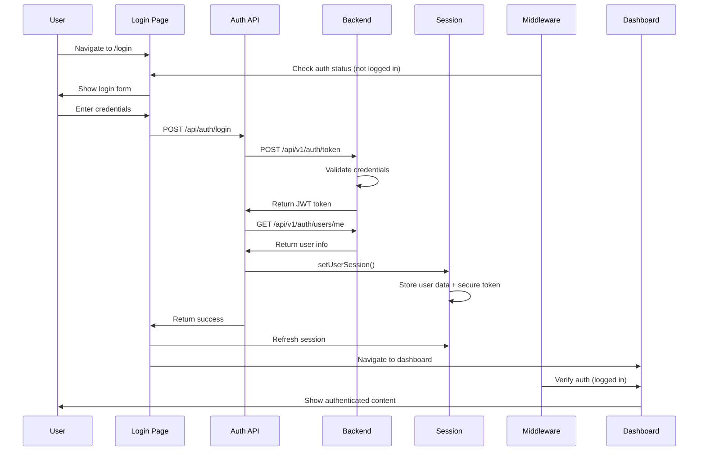
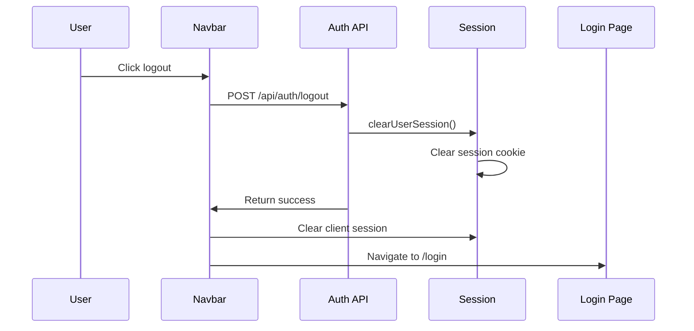
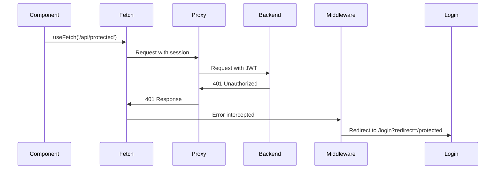

# Prebetter Application Workflows

This document details the critical workflows in the Prebetter SIEM dashboard application, covering user authentication, data fetching, error handling, and developer workflows.

## Table of Contents

1. [User Authentication Flow](#1-user-authentication-flow)
2. [Developer Workflows](#2-developer-workflows)
3. [Data Fetching Workflows](#3-data-fetching-workflows)
4. [Error Handling Workflows](#4-error-handling-workflows)

---

## 1. User Authentication Flow

### 1.1 Login Process

#### Sequence Diagram


#### Step-by-Step Process

1. **User Navigation**
   - User navigates to `/login`
   - Global auth middleware checks `requiresAuth` and `guestOnly` flags
   - Login page has `guestOnly: true`, so logged-in users are redirected

2. **Credential Submission**
   ```typescript
   // Frontend: /app/pages/login.vue
   const { data } = await $fetch('/api/auth/login', {
     method: 'POST',
     body: { username, password }
   })
   ```

3. **Server-Side Authentication**
   ```typescript
   // Server: /server/api/auth/login.post.ts
   // 1. Get JWT from backend
   const tokens = await $fetch(`${apiBase}/api/v1/auth/token`, {
     method: 'POST',
     body: new URLSearchParams({ username, password })
   })
   
   // 2. Fetch user details
   const userInfo = await $fetch(`${apiBase}/api/v1/auth/users/me`, {
     headers: { 'Authorization': `Bearer ${tokens.access_token}` }
   })
   
   // 3. Create session
   await setUserSession(event, {
     user: { /* user data */ },
     secure: { apiToken: accessToken },
     loggedInAt: new Date().toISOString()
   })
   ```

4. **Session Storage**
   - User data stored in regular session (accessible client-side)
   - JWT token stored in `secure` session (server-side only)
   - Session cookie is httpOnly and secure

5. **Post-Login Redirect**
   - Session is refreshed: `await session.fetch()`
   - User redirected to original page or dashboard
   - Redirect URL preserved in query param: `/login?redirect=/alerts`

### 1.2 Session Management

#### Session Structure
```typescript
interface UserSession {
  user: {
    id: number
    email: string
    username: string
    fullName: string
    isSuperuser: boolean
  }
  secure: {
    apiToken: string  // JWT token - server-side only
  }
  loggedInAt: string
}
```

#### Session Lifecycle
- **Creation**: On successful login
- **Duration**: 30 minutes (matches JWT expiration)
- **Refresh**: Automatic on page navigation
- **Access**: Via `useUserSession()` composable

### 1.3 Token Refresh and Expiration

Currently, the application does not implement automatic token refresh. When tokens expire:

1. API calls receive 401 responses
2. User redirected to login page
3. Original URL preserved for post-login redirect

**Future Enhancement**: Implement token refresh mechanism:
```typescript
// Proposed refresh flow
if (response.status === 401 && hasRefreshToken) {
  const newToken = await refreshAccessToken()
  // Retry original request
}
```

### 1.4 Logout Process

#### Sequence Diagram


#### Implementation
```typescript
// Frontend: /app/components/Navbar.vue
const handleLogout = async () => {
  await $fetch('/api/auth/logout', { method: 'POST' })
  await clear()  // Clear client-side session
  await router.push('/login')
}
```

### 1.5 Error Scenarios and Recovery

#### Invalid Credentials
1. Backend returns 401
2. Server API returns generic error
3. Frontend displays error message
4. Form remains active for retry

#### Network Errors
1. Fetch fails with network error
2. Error caught in try/catch
3. Loading state cleared
4. User can retry submission

#### Session Expiration
1. API call returns 401
2. Middleware redirects to login
3. Original URL preserved
4. User logs in and returns to original page

---

## 2. Developer Workflows

### 2.1 Local Development Setup

#### Prerequisites
```bash
# Backend
cd backend
cp .env.example .env  # Configure database credentials
uv sync               # Install Python dependencies

# Frontend  
cd frontend
bun install           # Install Node dependencies
```

#### Starting Development Servers
```bash
# Terminal 1: Backend
cd backend
uvicorn app.main:app --reload
# Runs on http://localhost:8000

# Terminal 2: Frontend
cd frontend
bun run dev
# Runs on http://localhost:3000
```

### 2.2 Adding New Authenticated Endpoints

#### Backend Endpoint Creation

1. **Create Route with Authentication**
   ```python
   # backend/app/api/v1/routes/new_feature.py
   from fastapi import APIRouter, Depends
   from ..routes.auth import get_current_user
   
   router = APIRouter(dependencies=[Depends(get_current_user)])
   
   @router.get("/data")
   async def get_data(current_user: User = Depends(get_current_user)):
       return {"user": current_user.username, "data": [...]}
   ```

2. **Register Route**
   ```python
   # backend/app/api/v1/__init__.py
   from .routes import new_feature
   api_router.include_router(
       new_feature.router,
       prefix="/new-feature",
       tags=["new-feature"]
   )
   ```

#### Frontend Integration

1. **Create API Proxy (if needed)**
   The catch-all proxy handles most cases automatically:
   ```typescript
   // Requests to /api/* are proxied with authentication
   const { data } = await useFetch('/api/new-feature/data')
   ```

2. **Custom Server Route (for complex logic)**
   ```typescript
   // server/api/new-feature/[action].ts
   export default defineEventHandler(async (event) => {
     const session = await getUserSession(event)
     const token = session.secure?.apiToken
     
     // Custom logic here
     return await $fetch(`${apiBase}/api/v1/new-feature/${action}`, {
       headers: { Authorization: `Bearer ${token}` }
     })
   })
   ```

### 2.3 Creating Protected Pages

#### Basic Protected Page
```vue
<!-- pages/protected.vue -->
<template>
  <div>Protected content here</div>
</template>

<script setup lang="ts">
definePageMeta({
  requiresAuth: true  // Enforced by auth middleware
})

// Session available via composable
const { user } = await useUserSession()
</script>
```

#### Role-Based Access
```vue
<script setup lang="ts">
definePageMeta({
  requiresAuth: true,
  middleware: async (to) => {
    const { user } = await useUserSession()
    if (!user.value?.isSuperuser) {
      throw createError({
        statusCode: 403,
        statusMessage: 'Admin access required'
      })
    }
  }
})
</script>
```

### 2.4 Implementing New UI Components

#### Component Creation Workflow

1. **Add shadcn-vue Component**
   ```bash
   bunx shadcn-vue@latest add dialog
   ```

2. **Create Feature Component**
   ```vue
   <!-- components/alerts/AlertDetails.vue -->
   <template>
     <Dialog v-model:open="isOpen">
       <DialogContent>
         <DialogHeader>
           <DialogTitle>Alert Details</DialogTitle>
         </DialogHeader>
         <!-- Content -->
       </DialogContent>
     </Dialog>
   </template>
   
   <script setup lang="ts">
   const props = defineProps<{
     alertId: number
   }>()
   
   const isOpen = defineModel<boolean>('open')
   
   // Fetch alert details
   const { data: alert } = await useFetch(`/api/alerts/${props.alertId}`)
   </script>
   ```

3. **Use in Pages**
   ```vue
   <template>
     <AlertDetails 
       v-model:open="showDetails" 
       :alert-id="selectedAlert"
     />
   </template>
   ```

### 2.5 Testing Authentication Scenarios

#### Unit Testing
```typescript
// tests/auth.test.ts
import { describe, it, expect } from 'vitest'

describe('Authentication', () => {
  it('redirects to login when not authenticated', async () => {
    const { redirect } = await $fetch('/api/protected', {
      redirect: 'manual'
    })
    expect(redirect).toBe('/login')
  })
})
```

#### Manual Testing Checklist
- [ ] Login with valid credentials
- [ ] Login with invalid credentials
- [ ] Access protected page without auth
- [ ] Access protected page with auth
- [ ] Logout and verify redirect
- [ ] Session expiration handling
- [ ] Role-based access control

---

## 3. Data Fetching Workflows

### 3.1 Server-Side Rendering with useFetch

#### Basic Pattern
```vue
<script setup lang="ts">
// SSR-friendly data fetching
const { data, pending, error, refresh } = await useFetch('/api/alerts', {
  query: {
    page: 1,
    limit: 20,
    severity: 'high'
  }
})
</script>
```

#### How It Works
1. **Server-Side**
   - Nuxt server makes request to `/api/alerts`
   - Catch-all proxy adds JWT from session
   - Data fetched from backend
   - HTML rendered with data

2. **Client-Side Hydration**
   - Payload includes fetched data
   - No duplicate requests
   - Reactive updates available

### 3.2 Client-Side Data Updates

#### Reactive Queries
```vue
<script setup lang="ts">
const page = ref(1)
const severity = ref('all')

// Reactive fetching - refetches when dependencies change
const { data, refresh } = await useFetch('/api/alerts', {
  query: {
    page,
    severity
  },
  watch: [page, severity]  // Auto-refresh on change
})

// Manual refresh
const handleRefresh = () => refresh()
</script>
```

#### Optimistic Updates
```typescript
// Update UI immediately, rollback on error
const updateAlert = async (id: number, updates: any) => {
  // Optimistic update
  const oldData = data.value
  data.value = { ...data.value, ...updates }
  
  try {
    await $fetch(`/api/alerts/${id}`, {
      method: 'PATCH',
      body: updates
    })
  } catch (error) {
    // Rollback on error
    data.value = oldData
    throw error
  }
}
```

### 3.3 Pagination and Filtering Patterns

#### Implementation Example
```vue
<template>
  <div>
    <!-- Filters -->
    <select v-model="filters.severity">
      <option value="">All Severities</option>
      <option value="high">High</option>
      <option value="medium">Medium</option>
      <option value="low">Low</option>
    </select>
    
    <!-- Data Table -->
    <table>
      <tbody>
        <tr v-for="alert in alerts" :key="alert.id">
          <!-- Row content -->
        </tr>
      </tbody>
    </table>
    
    <!-- Pagination -->
    <Pagination 
      v-model:page="currentPage"
      :total="totalPages"
    />
  </div>
</template>

<script setup lang="ts">
const currentPage = ref(1)
const filters = reactive({
  severity: '',
  classification: '',
  source_ip: ''
})

// Reactive query with debounce
const { data } = await useFetch('/api/alerts', {
  query: {
    page: currentPage,
    limit: 20,
    ...filters
  },
  watch: [currentPage, filters],
  debounce: 300  // Debounce filter changes
})

const alerts = computed(() => data.value?.items || [])
const totalPages = computed(() => data.value?.pages || 1)
</script>
```

### 3.4 Export Functionality Workflows

#### CSV Export Implementation
```vue
<script setup lang="ts">
const exportAlerts = async (format: 'csv' = 'csv') => {
  const params = new URLSearchParams({
    severity: filters.severity,
    start_date: filters.startDate,
    // ... other filters
  })
  
  // Direct download - browser handles auth cookie
  window.location.href = `/api/export/alerts/${format}?${params}`
}
</script>
```

#### Backend Streaming Response
```python
# Efficient streaming for large datasets
def generate_csv(results: Iterator, header: list) -> Iterator[str]:
    output = StringIO()
    writer = csv.writer(output)
    
    # Yield header
    writer.writerow(header)
    yield output.getvalue()
    
    # Stream data in chunks
    for row in results:
        output.seek(0)
        output.truncate(0)
        writer.writerow([...])
        yield output.getvalue()
```

### 3.5 Real-Time Data Considerations

#### Polling Pattern
```vue
<script setup lang="ts">
const { data, refresh } = await useFetch('/api/alerts/latest')

// Poll for updates
const { pause, resume } = useIntervalFn(refresh, 30000)

onMounted(() => resume())
onUnmounted(() => pause())
</script>
```

#### WebSocket Integration (Future)
```typescript
// Proposed WebSocket implementation
const { data, error } = await useWebSocket('/ws/alerts', {
  onMessage: (event) => {
    const alert = JSON.parse(event.data)
    // Update local state
  }
})
```

---

## 4. Error Handling Workflows

### 4.1 401 Unauthorized Flow

#### Sequence Diagram


#### Implementation Details

1. **API Response**
   ```typescript
   // Server proxy catches 401
   try {
     return await proxyRequest(event, target, { headers })
   } catch (error) {
     if (error.statusCode === 401) {
       // Session expired or invalid
       await clearUserSession(event)
     }
     throw error
   }
   ```

2. **Client Handling**
   ```vue
   <script setup>
   const { data, error } = await useFetch('/api/data')
   
   if (error.value?.statusCode === 401) {
     // Handled by middleware, user redirected
   }
   </script>
   ```

### 4.2 Network Error Recovery

#### Retry Mechanism
```vue
<script setup lang="ts">
const maxRetries = 3
const retryDelay = 1000

const fetchWithRetry = async (url: string, retries = 0) => {
  try {
    return await $fetch(url)
  } catch (error) {
    if (retries < maxRetries && isNetworkError(error)) {
      await new Promise(resolve => setTimeout(resolve, retryDelay))
      return fetchWithRetry(url, retries + 1)
    }
    throw error
  }
}

// Usage with error display
const { data, error, execute } = await useAsyncData(
  'alerts',
  () => fetchWithRetry('/api/alerts')
)
</script>

<template>
  <div v-if="error" class="error-state">
    <p>Failed to load data</p>
    <Button @click="execute">Retry</Button>
  </div>
</template>
```

### 4.3 Form Validation Patterns

#### Client-Side Validation
```vue
<script setup lang="ts">
const form = reactive({
  username: '',
  password: ''
})

const errors = reactive({
  username: '',
  password: ''
})

const validate = () => {
  errors.username = form.username.length < 3 
    ? 'Username must be at least 3 characters' 
    : ''
  errors.password = form.password.length < 8 
    ? 'Password must be at least 8 characters' 
    : ''
  
  return !errors.username && !errors.password
}

const handleSubmit = async () => {
  if (!validate()) return
  
  try {
    await $fetch('/api/auth/login', {
      method: 'POST',
      body: form
    })
  } catch (error) {
    if (error.statusCode === 400) {
      // Handle validation errors from server
      errors.username = error.data?.username
      errors.password = error.data?.password
    }
  }
}
</script>
```

#### Server-Side Validation
```python
# Backend validation with detailed errors
@router.post("/users")
async def create_user(user_data: UserCreate):
    errors = {}
    
    if len(user_data.username) < 3:
        errors["username"] = "Username too short"
    
    if existing_user := get_by_username(user_data.username):
        errors["username"] = "Username already taken"
    
    if errors:
        raise HTTPException(
            status_code=400,
            detail={"errors": errors}
        )
```

### 4.4 User Feedback Mechanisms

#### Toast Notifications
```vue
<script setup lang="ts">
const toast = useToast()

const saveData = async () => {
  try {
    await $fetch('/api/data', { 
      method: 'POST',
      body: formData 
    })
    
    toast.success('Data saved successfully')
  } catch (error) {
    toast.error(getErrorMessage(error))
  }
}

const getErrorMessage = (error: any) => {
  if (error.statusCode === 404) {
    return 'Resource not found'
  }
  if (error.statusCode === 403) {
    return 'You do not have permission'
  }
  return 'An error occurred. Please try again.'
}
</script>
```

#### Loading States
```vue
<template>
  <!-- Global loading indicator -->
  <NuxtLoadingIndicator />
  
  <!-- Component loading state -->
  <div v-if="pending" class="loading-state">
    <Icon name="lucide:loader-2" class="animate-spin" />
    <p>Loading alerts...</p>
  </div>
  
  <!-- Error state -->
  <div v-else-if="error" class="error-state">
    <Icon name="lucide:alert-triangle" />
    <p>{{ error.message }}</p>
    <Button @click="refresh">Try Again</Button>
  </div>
  
  <!-- Success state -->
  <div v-else>
    <!-- Content -->
  </div>
</template>
```

#### Inline Error Display
```vue
<template>
  <form @submit.prevent="handleSubmit">
    <div class="form-group">
      <Input 
        v-model="username"
        :class="{ 'border-destructive': errors.username }"
      />
      <p v-if="errors.username" class="text-destructive text-sm">
        {{ errors.username }}
      </p>
    </div>
  </form>
</template>
```

---

## Best Practices Summary

### Authentication
1. Store JWT tokens in secure session only
2. Use httpOnly cookies for sessions
3. Implement proper CORS configuration
4. Handle token expiration gracefully
5. Preserve redirect URLs through login flow

### Data Fetching
1. Use `useFetch` for SSR compatibility
2. Implement proper loading states
3. Handle errors at component level
4. Use reactive queries for filters
5. Debounce user input
6. Stream large exports

### Error Handling
1. Provide clear user feedback
2. Implement retry mechanisms
3. Log errors for debugging
4. Handle network failures gracefully
5. Validate on client and server

### Security
1. Never expose tokens to client
2. Validate all user input
3. Use HTTPS in production
4. Implement rate limiting
5. Sanitize displayed data